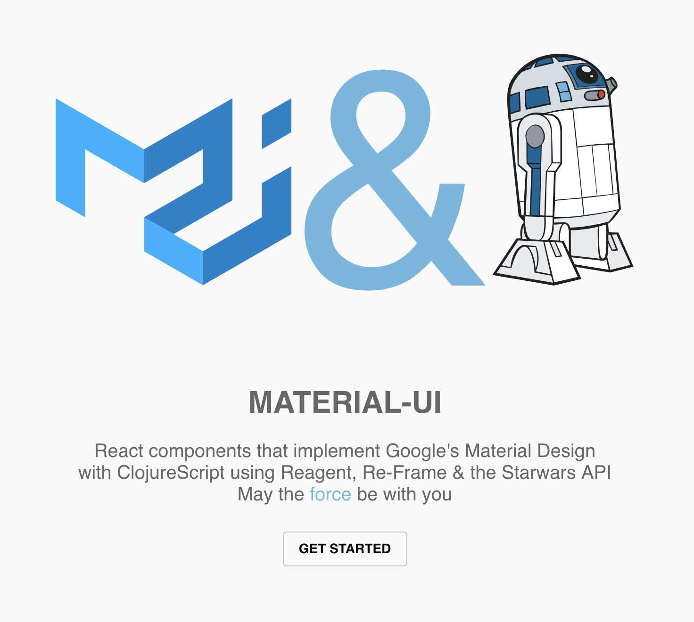

# Reagent, Re-frame & Material UI

Fork from : https://github.com/headwinds/reagent-reframe-material-ui



- [Reagent](https://github.com/reagent-project/reagent)
- [Re-frame](https://github.com/Day8/re-frame)
- [Material UI](https://material-ui.com/)
- [Starwars API](http://swapi.co/)

Inspired by the [material ui](https://material-ui.com/) site which has a really nice look and feel, I thought would also be nice to port all the component demos to ClojureScript using a similar layout and approach.

This repo represents a start at this design goal and begins to outline the skeleton but the demos are not fully fleshed out yet. This is where we need your help. So why don't we combine "the world's popular framework" with data from one of the best sci-fi movie series, Star Wars?

## Demo

[demo](https://reagent-reframe-material.now.sh)

## Start

```
lein figwheel
```

## Create an alias

```
ln -n /path/to/this/project ~/starwars
cd starwars
```

Open browser to http://localhost:5000/

## Contributing

This is great opportunity to learn Reagent, Re-frame and Material-UI as a group.

Please use the demo-template.cljs to create your component demo and it the list in sidebar.cljs file.

## Deployment to Zeit

```
now
```

## Deployment to Heroku

Copy this example folder into a new directory outside of this git repo so that it has it own git repo. We don't want to have nested repos. A future improvement would to have a build script that would automatically move it.

!! Copy and paste this folder into a new directory outside of this project repo !!

1.  View the project the browser which also compiles necessary files that are later built in the uberjar

```
lein figwheel
```

2.  Create the uberjar

```
lein with-profile -dev,+production uberjar
```

3.  Deploy to Heroku

```
heroku login
git init
git add .
git commit -m "first commit"
heroku create
git push heroku master
heroku ps:scale web=1
heroku open
```

Note: because you moved this into a new directory, you shouldn't have a problem but if you happen to have github repo too you will need to add heroku. After you do the step `heroko create` you will need to add the heroku path `heroku git:remote -a radiant-falls-68370` replacing that radiant-falls-68370 with whatever heroku spit out for you.

Then open your browser whatever url it created ie: https://glacial-badlands-20785.herokuapp.com/

## Credit

* [Core.async](https://tech.kontor.com/clojures-core-async-how-we-use-it-c5ebc62d0845)
* [reagent with transition group example](https://github.com/AlexanderWingard/reagent-with-transition-group-example)
